# be11-fin-1team-BestPlace-FE

  

<h3 align="center">🎯 알고리즘은 똑똑하게, 수수료는 가볍게</h3>

  창작자와 콘텐츠를 위한 <strong>진짜 베스트 플레이스</strong>

  
  <strong>Team Best - Place</strong>  

  
  
|  |  |  |  |  
| :---: | :---: | :---: | :---: |  
| **팀장** 장기현 | **팀원** 고준혁 | **팀원** 최영재 | **팀원** 소병윤 |  
   
  
## 📌 프로젝트 개요  
인터넷 방송 플랫폼은 **게임, 엔터테인먼트, 교육, 토크 방송 등 다양한 콘텐츠가 실시간으로 소비**되는 공간으로 발전해왔습니다.    
현재 유튜브 라이브, 숲, 치지직과 같은 대형 플랫폼들이 시장을 주도하고 있으며, 글로벌 인터넷 방송 시장은 꾸준히 성장하고 있습니다.  
  
하지만, 기존 플랫폼에는 여러 가지 **기술적 및 사용자 경험적 한계**가 존재합니다.    
이에 따라, 우리는 이러한 문제를 해결하고 **새로운 기능과 차별화된 서비스를 제공하는 인터넷 방송 플랫폼**을 개발하고자 합니다.  
  
---  
  
## 🔍 기존 인터넷 방송 플랫폼의 문제점  
  
### 1️⃣ **콘텐츠 검색 및 추천 시스템의 한계**  
기존 인터넷 방송 플랫폼에서는 대부분 **기본적인 키워드 검색**에 의존하고 있으며,    
사용자의 취향을 반영한 **정교한 콘텐츠 추천 기능이 부족**합니다.  
  
- 🔎 사용자는 **정확한 검색어를 입력해야만 원하는 방송을 찾을 수 있음**  
- 🔎 특정 장르나 스타일의 방송을 추천받기가 어려움  
- 🔎 플랫폼이 제공하는 추천 시스템이 정교하지 않거나, 단순한 인기 순위 기반  
  
이러한 한계를 개선하기 위해, **더욱 정밀하고 개인화된 검색 및 추천 시스템이 필요**합니다.  
  
---  
  
### 2️⃣ **수익 구조의 불합리성**  
현재 대부분의 인터넷 방송 플랫폼은 **스트리머(창작자)**들이 수익을 창출할 수 있도록 다양한 시스템을 제공하지만,    
많은 경우 **높은 플랫폼 수수료**로 인해 창작자의 수익성이 제한됩니다.  
  
- 💰 일부 플랫폼은 후원(Donation) 및 구독(Subscription) 수익의 **30~50%를 가져감**  
- 💰 수익 배분이 불리한 경우, 창작자들은 타 플랫폼과 **동시 송출(멀티 스트리밍)이 금지되는 정책**을 따를 수밖에 없음  
  
이러한 문제로 인해, 창작자들은 특정 플랫폼에 종속되거나, 더 나은 수익 환경을 제공하는 새로운 대안을 찾고 있습니다.  
  
---  
  
## 🚀 해결 방안  
  
### ✅ **콘텐츠 검색 및 추천 시스템 개선**  
- 🎯 **벡터 검색(Vector Search) 기술 도입**  
 - 방송 제목, 태그, 내용, 시청자의 행동 데이터를 기반으로 **더 정교한 추천 시스템** 개발기
  
  - 단순한 키워드 검색을 넘어 **사용자의 선호도와 콘텐츠 특성을 반영한 개인화된 추천 제공**  
  
### ✅ **수익 구조 개선**  
- 🎯 **창작자 친화적인 수익 모델 도입**  
 - 기존 플랫폼보다 **낮은 수수료 정책** 적용  
 - 창작자가 더 자유롭게 활동할 수 있도록 **타 플랫폼 동시 송출(멀티 스트리밍) 가능 정책** 적용  
  
이 프로젝트를 통해, **콘텐츠 검색 및 추천 기능을 혁신하고, 창작자들에게 더 나은 환경을 제공하는 플랫폼**을 구축하고자 합니다.  
  
---  
  
## 🙌요구사항정의서🙌  
 🫐  [Best Place 요구사항 정의 링크](https://www.notion.so/1baf0067972e80769e36c1866ceb58be?v=1baf0067972e8012b320000cb0f028f4)  
   
 ## 화면 설계서  
  [화면설계서 Figma](https://www.figma.com/design/LfcFCsv0qpYgdNwsT6GemD/%EB%B2%A0%ED%94%8C-%ED%99%94%EB%A9%B4-%EC%84%A4%EA%B3%84%EC%84%9C?node-id=2-3&p=f&t=9FRrDxEHNCkFshRE-0)  
 
   
 ## WBS  
  [WBS정의서](https://docs.google.com/spreadsheets/d/15KsDFjX-OgTwRF71ssppmwlwviHkTMK06UreymjLiPQ/edit?gid=1078812322#gid=1078812322)  

## API 명세서
[API명세서](https://awesome-currant-ce6.notion.site/1d2f0067972e8062ad4ae1f2489a768c?v=1d2f0067972e80aca638000cf3e3af3b&pvs=4)  

[스트리밍모듈 단위테스트결과서](https://documenter.getpostman.com/view/43669175/2sB2cYcLJg#935a4f70-84d4-487e-9755-b769cd20fce9)  

[멤버모듈 단위테스트결과서](https://documenter.getpostman.com/view/19204795/2sB2cYcfiA#63fcad7d-a267-4e0d-adb6-56f96c9ff036)  
   
 ## ERD  
   
 [ERD 주소](https://www.erdcloud.com/d/LWyks2zPfKCYL3oMY)  
 
  [ERD 이미지](https://photos.app.goo.gl/FWysPS7p8ivq2FMy9)
 
[Streaming-Service](https://photos.app.goo.gl/7mw8f3MU2dNcC3mt7)
   
[Member&Post-Service](https://photos.app.goo.gl/c8R4CDyiZdf9Toas6) 
  
[Payment-Service](https://photos.app.goo.gl/EYQDgiquBeH7Mu7P8) 

## 🎮 기술 스택

### BACKEND

### FRONTEND

###  DB

### 외부API

### 협업도구

&nbsp;

## 🖥️ UX/UX 단위테스트
### 홈 / 팔로잉 / 카테고리 

홈 화면

 

팔로잉 탭

 

카테고리 리스트

 

카테고리 디테일리스트

 

### 후원 및 라이브

채팅 후원

 

미션 후원 (등록,거절,성공)

 

라이브 방송 댓글 기능 및 차단 기능

 

### 스트리머

스트리머 등록

 

스트리머 화면 방송 시작

 

스트리머 채팅

 

스트리머 방송설정

 

스트리머 매니저관리

 

스트리머 팔로워관리

 

### 알림

알림 푸쉬

 

알림 리스트

 

### 유저 관련 기능

검색

 

- 닉네임 초성검색 및 자동완성검색

베리 관련 기능 모음

 

#### 베리 결제

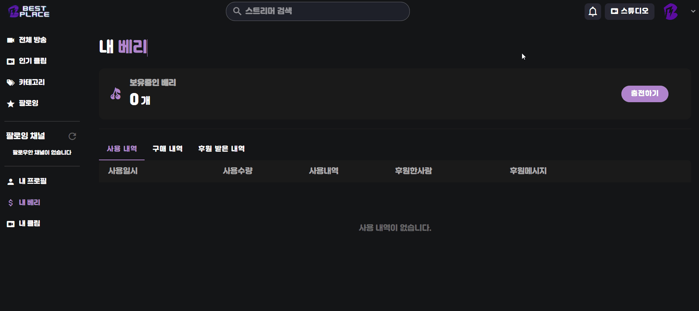

#### 베리 환불

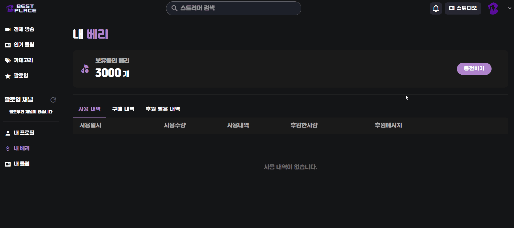

채널 관련 기능 모음

 

#### 홈

#### 동영상 탭

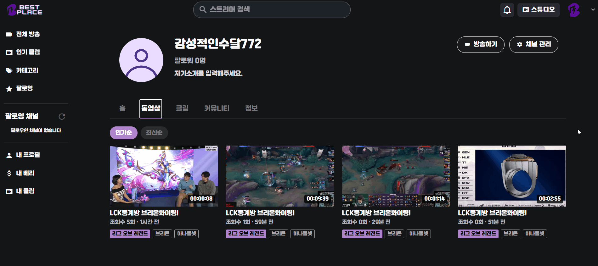

#### 클립 탭

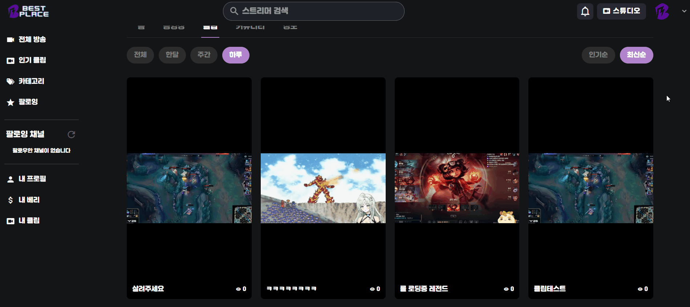

#### 커뮤니티 탭

#### 소셜 및 배너 수정

내 프로필

 

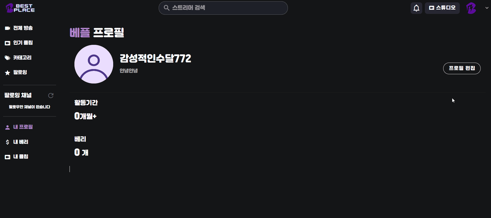

### 클립 관련 기능

클립 상세보기- 스와이프

 

클립 상세보기- 성인컨텐츠

 

클립 생성

 

인기 클립

 

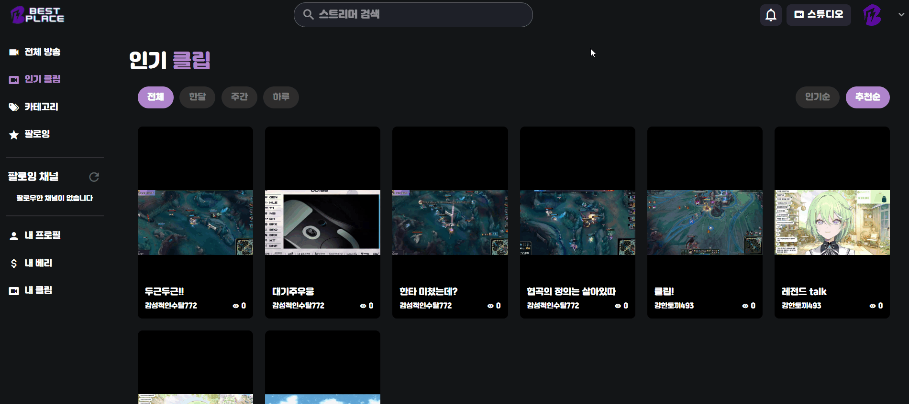

내 클립

 

  

클립 대댓글

 

클립 좋아요

 

### 다시보기 관련 기능

다시보기 pip모드

 

다시보기 배속모드

 

다시보기 다운로드

 

다시보기 성인컨텐츠 알림

 

다시보기 비로그인

 

다시보기 클립생성

 

다시보기 팔로우

 

다시보기 디테일

 

다시보기 댓글좋아요-삭제

 

다시보기 댓글 작성

 

다시보기 댓글 수정

 

### 커뮤니티

커뮤니티 게시글 생성

 

커뮤니티 게시글 수정

 

커뮤니티 게시글 삭제

 

커뮤니티 게시글 좋아요

 

커뮤니티 게시글 좋아요 취소

 

커뮤니티 게시글 댓글/대댓글 생성

 

커뮤니티 게시글 댓글 좋아요

 

커뮤니티 게시글 댓글 좋아요 취소

 

커뮤니티 게시글 댓글 수정

 

커뮤니티 게시글 댓글 삭제

 

### ⚙️ CI/CD계획서 및 시스템아키텍처설계서
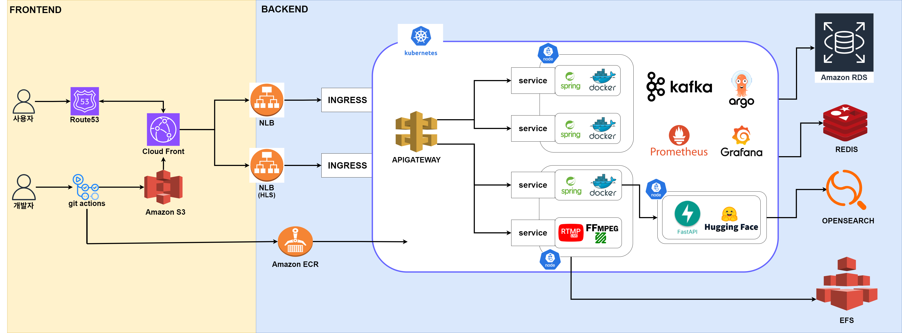
## ArgoCD

ArgoCD 내부에서 관리하는 애플리케이션

 

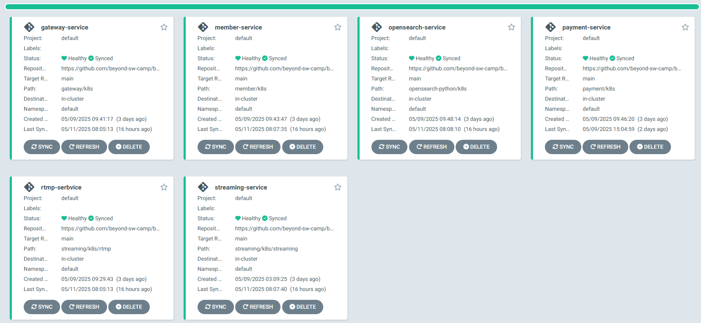

ArgoCD에서 제공해주는 애플리케이션 내부 구조

 

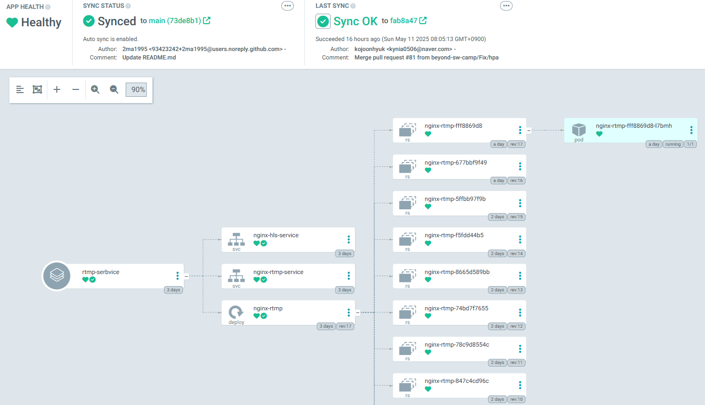

Git Hub main코드의 yml설정과 클러스터 내부의 설정이 맞지않을때

 

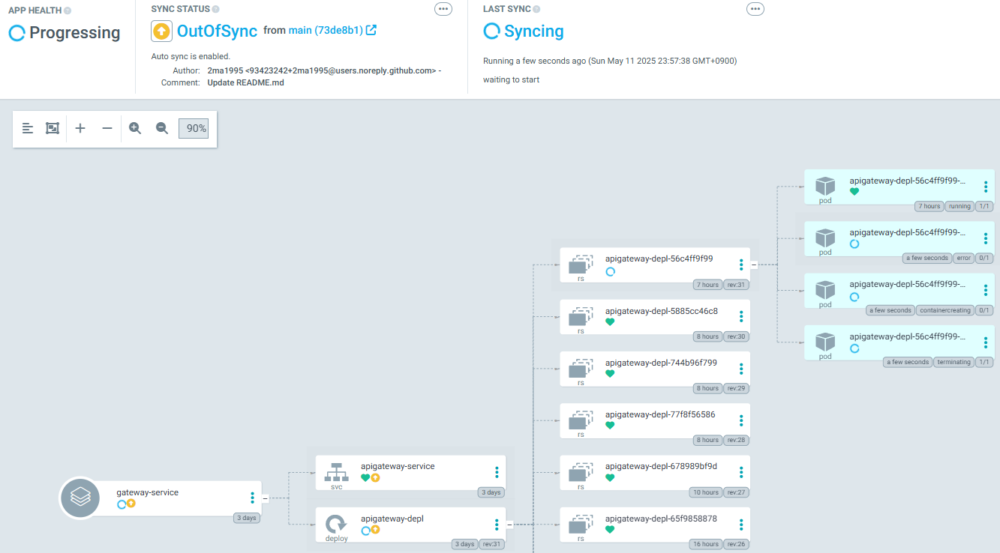

Git Hub main yml 코드 기준으로 ArgoCD가 롤백처리

 

 

## Prometheus, Grafana

Grafana 기본 대시보드

 

Grafana BestPlace 커스텀 대시보드

 

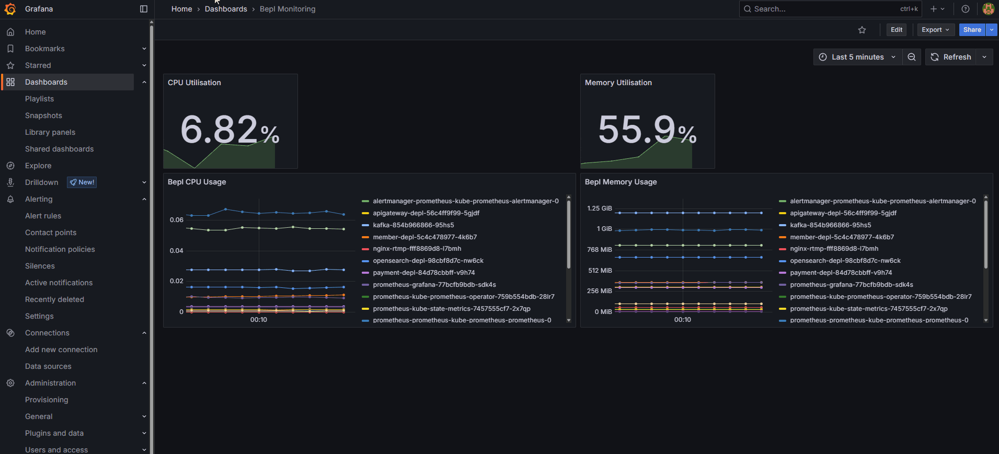

Grafana에 설정한 노드의 MEMORY or CPU 90% 초과 6분이상 시 디스코드 알림

 

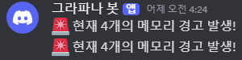

